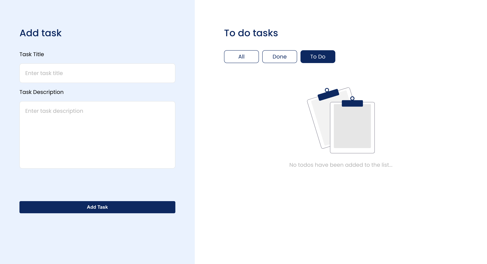
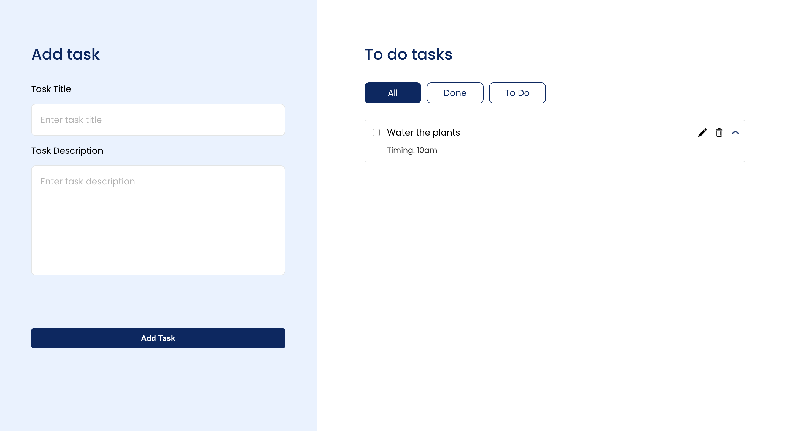
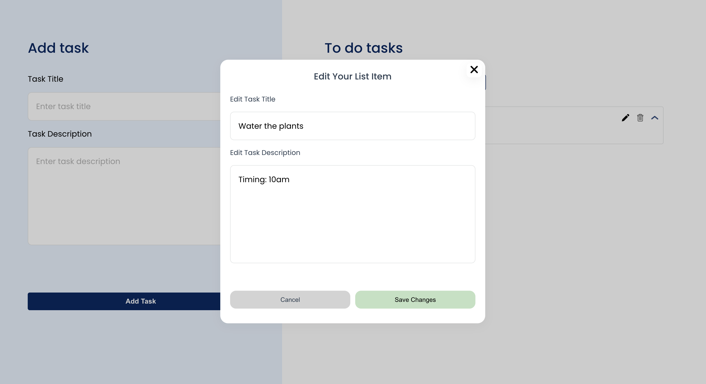
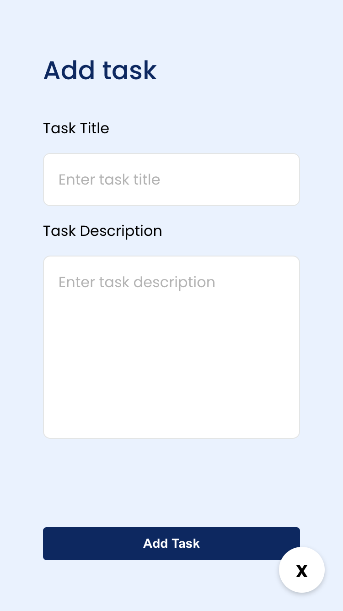

<a name="readme-top"></a>

<!-- PROJECT LOGO -->
<br />
<div align="center">
  <h3 align="center">Learnyst Todo Application</h3>

  <p align="center">
   A thoughtfully engineered platform, designed with user-friendly features, to assist you in efficiently managing and tracking all your daily tasks, goals, and aspirations, ensuring you maintain a clear focus on your priorities.
    <br />
    <a href="https://github.com/Deb77/learnyst-todo"><strong>Explore the docs »</strong></a>
    <br />
    <br />
    <a href="https://learnyst-todo.pages.dev/">View Demo</a>
    ·
    <a href="https://github.com/Deb77/learnyst-todo/issues/new?labels=bug&template=bug-report---.md">Report Bug</a>
    ·
    <a href="https://github.com/Deb77/learnyst-todo/issues/new?labels=enhancement&template=feature-request---.md">Request Feature</a>
  </p>
</div>

<!-- TABLE OF CONTENTS -->
<details>
  <summary>Table of Contents</summary>
  <ol>
    <li>
      <a href="#about-the-project">About The Project</a>
      <ul>
        <li><a href="#built-with">Built With</a></li>
      </ul>
    </li>
    <li>
      <a href="#getting-started">Getting Started</a>
      <ul>
        <li><a href="#prerequisites">Prerequisites</a></li>
        <li><a href="#installation">Installation</a></li>
      </ul>
    </li>
    <li><a href="#usage">Usage</a></li>
  </ol>
</details>

<!-- ABOUT THE PROJECT -->

## About The Project



Introducing a user-friendly Todo List - your go-to companion for managing tasks effortlessly. From jotting down quick reminders to organizing comprehensive projects, our straightforward interface ensures seamless navigation across all your devices. Stay organized, prioritize tasks, and experience the satisfaction of ticking off completed items. Simplify your life and boost productivity with our Todo List today.

### Built With

- Next.js
- React.js
- Redux Toolkit
- Redux Persist
- Classnames
- Pure CSS

### Prerequisites

This is an example of how to list things you need to use the software and how to install them.

- node
  ```
  v>=18.0.0
  ```
- npm
  ```sh
  npm install npm@latest -g
  ```

### Installation

1. Clone the repo
   ```sh
   git clone https://github.com/Deb77/learnyst-todo
   ```
2. Install NPM packages
   ```sh
   npm install
   ```
3. To run the project
   ```sh
    npm run dev
   ```

<p align="right">(<a href="#readme-top">back to top</a>)</p>

<!-- USAGE EXAMPLES -->

## Usage

### Homepage



### Edit Todo



### Create Todo Mobile



<p align="right">(<a href="#readme-top">back to top</a>)</p>
